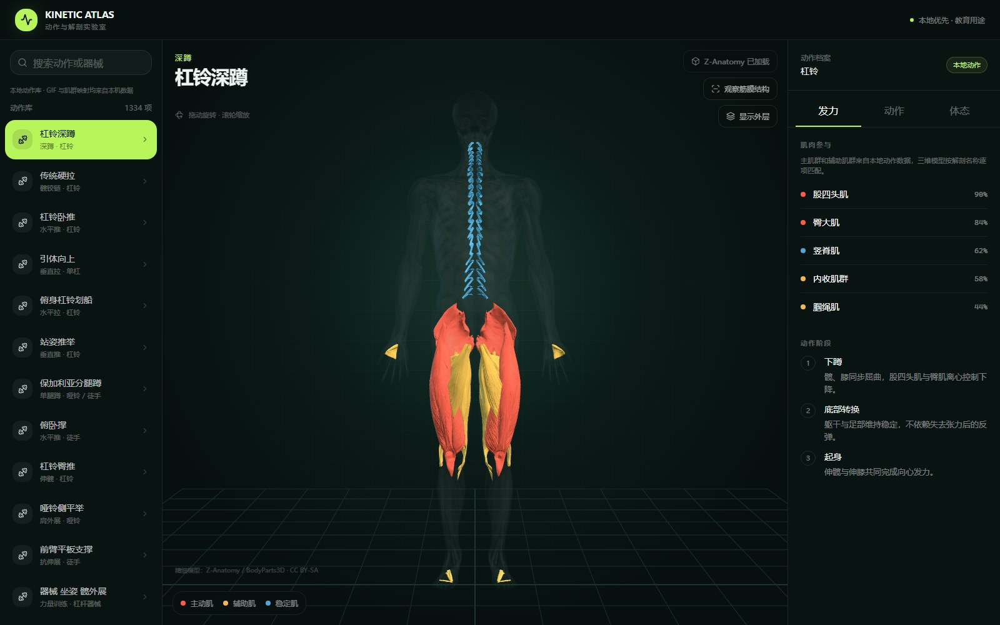
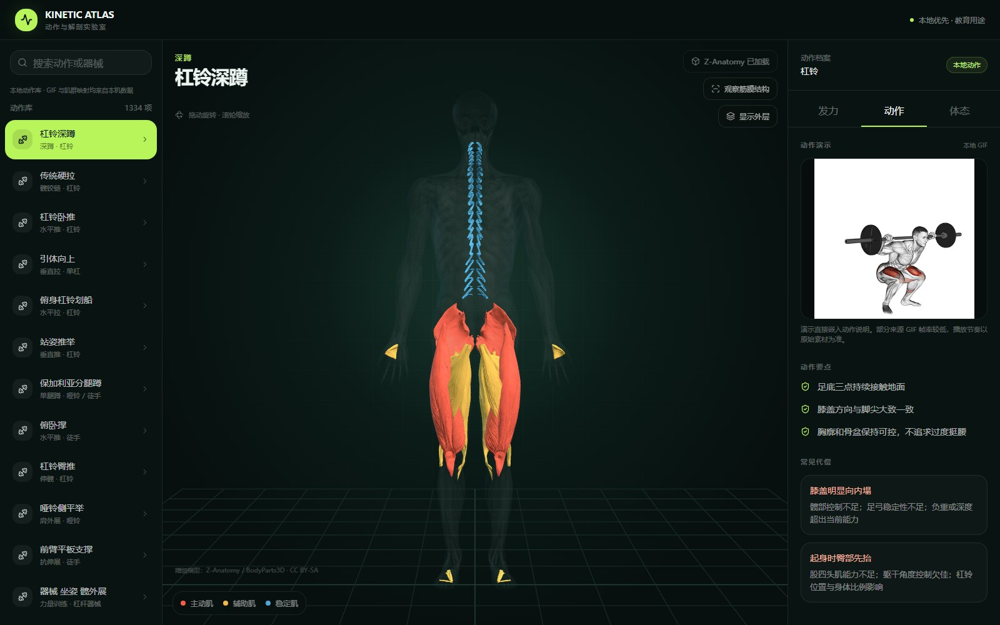
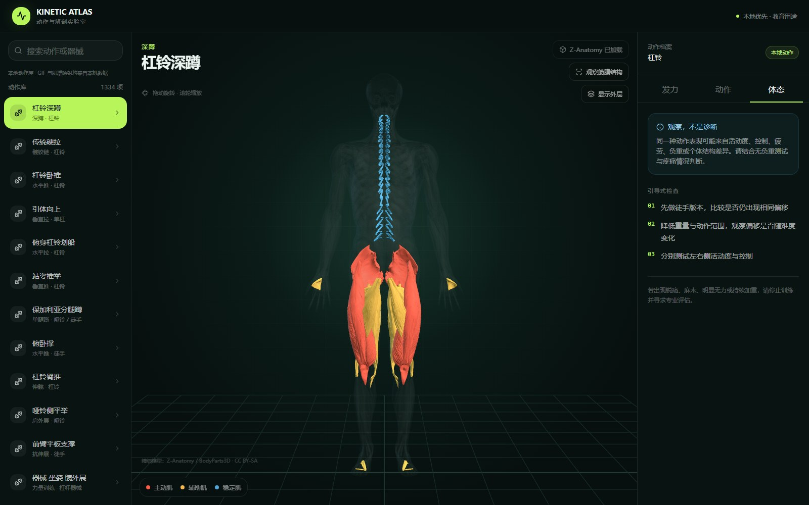

# Kinetic Atlas

[](LICENSE)
[](package.json)

Kinetic Atlas 是一个本地优先的健身动作与 3D 解剖学习工具。它把动作 GIF、主肌群、辅助肌群和 Z-Anatomy 精细人体模型放在同一界面中，用于理解动作发力、常见代偿和体态观察思路。

> 本项目用于运动学习与教育，不提供医学诊断。肌肉参与百分比是教学用相对权重，不是 EMG 实测值。

## 界面预览



<table>
  <tr>
    <td width="50%"></td>
    <td width="50%"></td>
  </tr>
  <tr>
    <td align="center">本地 GIF、动作要点与常见代偿</td>
    <td align="center">体态观察提示与引导式检查</td>
  </tr>
</table>

## 功能

- 1334 个动作条目：11 个精编动作与 1323 个本地动作索引。
- 每个动作直接显示本地 GIF，无需手动导入。
- 默认加载 Z-Anatomy 高精度肌肉模型，支持旋转、缩放、外层区域和筋膜结构观察。
- 根据动作的主肌群、辅助肌群和稳定肌高亮 3D 解剖网格。
- 提供动作阶段、动作要点、常见代偿和引导式体态检查。
- 完全本地读取动作数据和媒体，运行时不依赖第三方 API。
- 内置肌群映射审计，验证动作数据与 686 个 FBX 网格的匹配情况。

## 技术栈

- React 19、Next.js 兼容层与 Vinext/Vite
- Three.js、FBXLoader、OrbitControls
- TypeScript、Tailwind CSS
- Cloudflare Workers/Wrangler 本地运行环境

## 快速开始

### 环境要求

- Node.js 22.13 或更高版本
- npm
- Windows PowerShell 7（用于一键下载本地媒体）

### 1. 安装依赖

```powershell
npm install
```

### 2. 下载本地模型和 GIF

```powershell
powershell -ExecutionPolicy Bypass -File scripts/download-local-media.ps1
```

脚本会下载约 0.40 GiB 的资源到 `public/media/`：

- Z-Anatomy 的 `MuscularSystem100.fbx` 和 `Regions of human body100.fbx`
- ExerciseGymGifsDB v1.1.0 的动作索引与 1323 个 GIF

媒体目录不会提交到 Git。下载中断后重新运行即可补齐缺失文件。

### 3. 启动开发服务

```powershell
npm run dev
```

打开 `http://127.0.0.1:3000/`。

### 4. 生产构建

```powershell
npm run build
npm start
```

生产服务默认运行在 `http://127.0.0.1:8787/`。

## 常用命令

| 命令 | 说明 |
| --- | --- |
| `npm run dev` | 启动开发服务 |
| `npm run lint` | 运行 ESLint |
| `npm run build` | 生成生产构建 |
| `npm start` | 启动本地生产服务 |
| `npm run catalog:build` | 从本地原始索引重新生成中文动作数据库 |
| `npm run anatomy:audit` | 扫描 FBX 网格并审计全部动作肌群映射 |
| `npm run screenshots` | 在开发服务运行时重新生成 README 截图 |

## 数据与肌群映射

中文动作数据库位于 `data/exercises.zh.json` 和 `public/data/exercises.zh.json`。映射过程保留来源记录中的全部主肌群和辅助肌群，并将其解剖别名匹配到 Z-Anatomy 的实际 FBX 网格名称。

```powershell
npm run anatomy:audit
```

当前审计基线：1323 条来源动作、3236 条肌肉参与记录、19 类来源肌群、686 个 FBX 网格、0 条未匹配动作。

## 项目结构

```text
app/                           页面与全局样式
components/anatomy-viewer.tsx  Three.js 解剖模型与肌群高亮
lib/exercise-data.ts           精编动作数据与类型
lib/external-catalog.ts        本地动作转换、翻译和肌群映射
data/                          生成后的中文动作数据库
public/data/                   浏览器读取的中文动作数据库
scripts/                       媒体安装、数据库生成和审计脚本
.github/                       CI、Issue 与 PR 模板
```

## 第三方资源与版权

第三方模型和 GIF 不包含在 Git 仓库中，也不属于本项目的 AGPL 代码许可范围。

- 解剖模型归属与许可见 [ANATOMY_ATTRIBUTION.md](ANATOMY_ATTRIBUTION.md)。
- 动作 GIF 的使用边界见 [MEDIA_NOTICE.md](MEDIA_NOTICE.md)。

请在重新分发任何第三方媒体前自行确认授权。ExerciseGymGifsDB 的维护者明确说明其不拥有相关 GIF 的版权，也无法授予第三方再分发权。

## 贡献

欢迎提交问题、改进文档和修正肌群映射。开始前请阅读 [CONTRIBUTING.md](CONTRIBUTING.md) 和 [CODE_OF_CONDUCT.md](CODE_OF_CONDUCT.md)。安全问题请按 [SECURITY.md](SECURITY.md) 私下报告，不要创建公开 Issue。

## 许可

应用源代码采用 [GNU Affero General Public License v3.0 or later](LICENSE)。第三方媒体保持其各自许可和版权状态。
